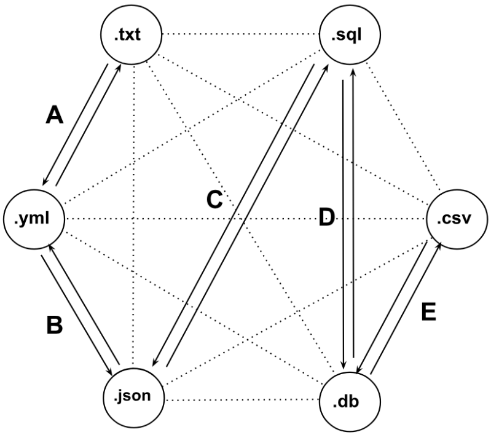

<br />
<div align="center">
  <a href="https://github.com/dong-wkim/dandoc">
    
  </a>

  <h3 align="center">Dandoc</h3>

  <p align="center">
    "Dandoc" is my (Dan's) version of the popular file conversion method Pandoc. <br />
    <br />
    This repository converts simple plaintext (.txt) outline syntax to relational database table creation through network graph theory.
    <br />
    <br />
    <a href="https://github.com/dong-wkim/dandoc"><strong>Explore the docs »</strong></a>
    <br />
    <br />
    <a href="https://github.com/dong-wkim/dandoc">View Demo</a>
    &middot;
    <a href="https://github.com/dong-wkim/dandoc/issues/new?labels=bug&template=bug-report---.md">Report Bug</a>
    &middot;
    <a href="https://github.com/dong-wkim/dandoc/issues/new?labels=enhancement&template=feature-request---.md">Request Feature</a>
  </p>
</div>
<!-- network graph for conversions here -->


## file formats

```python
formats = [
    '.txt', 
    '.yaml', 
    'json',
    'sql',
    'csv',
    'db' 
]
```

## python scripts

### forward conversion

| no. | input | output |     src      |
| :-- | :---: | :----: | :----------: |
| 1   |  txt  |  yaml  | txt_yaml.py  |
| 2   |  yaml |  json  | yaml_json.py |
| 3   |  json |  sql   | json_sql.py  |
| 4   |  sql  |   db   |  sql_db.py   |
| 5   |   db  |  csv   |  db_csv.py   |

### backwards conversion

| no. | input | output |      src     |
| :-- | :---: | :----: | :----------: |
| 6   | yaml  |  txt   | yaml_txt.py  |
| 7   | json  |  yaml  | json_yaml.py |
| 8   |  sql  |  json  | sql_json.py  |
| 9   |  db   |  sql   | db_sql.py    |
| 10  |  csv  |   db   | csv_db.py    |
